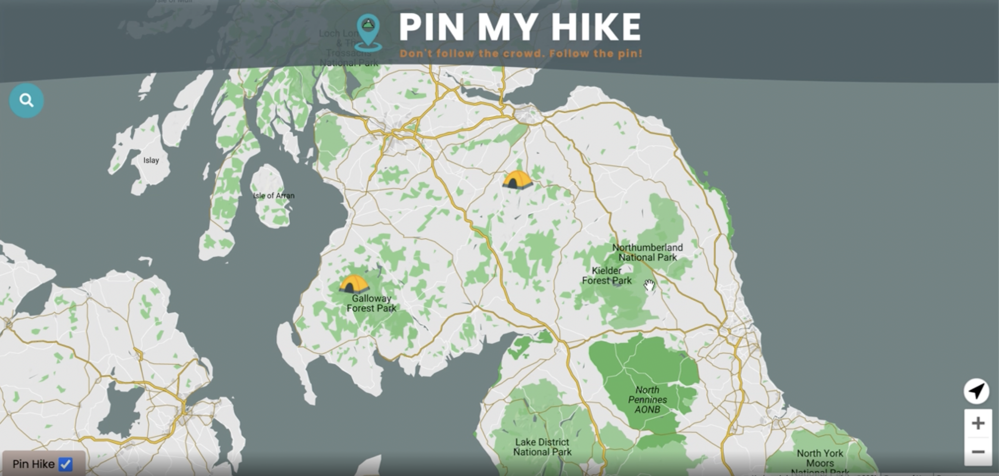

<h1 align="center">
Cynthia Fu
</h1>

[Projects](#projects) |
[Experience](#experience) |
[Education](#education) |
[Hobbies & Interests](#hobbies--interests) 

I am a recent Makers Academy graduate with a BSc Mathematics degree from University of Manchester.

In my previous role I was an international Payroll Lead at Deliveroo where I was a SME focused on projects whilst overseeing BAU. Inspired by my peers and the tech/start-up culture, I finally decided to make a switch into Software Engineering. 

I am a determined and enthusiastic individual always willing to learn new skills. I have a proven track-record of delivering quality and I am determined to make an impact as a Software Engineer. 

I am looking for a role that enables learning and growth. Company culture is also very important to me. 

---

## Projects

| Name                         | Tech/tools        |
| ---------------------------- | ----------------- |
| <a href="https://github.com/YinnyF/pin-my-hike">Pin My Hike</a>   A collection of hiking experiences viewable as a pin on a map. A two week group project learning a new tech stack from scratch.     | **Tech stack**   JavaScript, MERN (MongoDB, Express, React, Node), MongoDB Atlas, Google API    **Testing**  Jest, Insomnia    **Other Tools**  Miro, Trello |
| <a href="https://github.com/YinnyF/bank_tech_test">Ruby Bank</a>   A mock tech test simulating a bank in Ruby showcasing my skills such as OOP, TDD.    | **Language**   Ruby    **Testing**  RSpec | 
|<a href="https://github.com/YinnyF/news-summary-challenge">News Summary</a>    A single page app made using vanilla JS, a self-made testing framework, and the Guardian (News) API.    | **Languages**   JavaScript, CSS, HTML    **Testing**   Sunflower (written by me)    |
|<a href="https://github.com/YinnyF/bowling-challenge">Bowling Scorecard JavaScript</a>    A backend bowling scorecard written in JavaScript to practise JavaScript.   | **Language**   JavaScript   **Testing**  Jasmine    |
|<a href="https://github.com/YinnyF/bowling-challenge-ruby">Bowling Scorecard Ruby</a>    A backend bowling scorecard written in Ruby to demonstrate use of TDD, SRP, encapsulation, clean code.    | **Language**  Ruby    **Testing**  RSpec    |

## Experience

### **Roofoods Ltd t/a Deliveroo** - London (Aug 2019 - Dec 2020)  
_Payroll Lead - UK/USA/IRE_

Systems: Workday HCM, Workday Payroll, iiPAY, Benefex

Notable Achievements: received Deliveroo Values Award (Q2 2020) in my first year of employment

* Lead the UK, IRE & USA payroll team (iiPAY, Deliveroo Payroll Assistant)
* Lead the UK Payroll Transformation project from outsourced model to in-house
* Lead on UK furlough project
* Global furlough
* Team member in the Global Payroll Transformation Project
* Managed relationship with 3rd party suppliers: payroll provider (iiPAY), benefits provider (Benefex), pensions providers (Legal & General)
* Process improvements & process writing
* Company ProMapp process champion: supported colleagues on planning and writing business processes
* BAU Troubleshooting
* Communicating to key stakeholders
* Reporting
  

### **The Genuine Dining Co. Ltd (Group Genuine)** - London (Apr 2018 - Aug 2019)  
_Payroll Clerk_

Systems: Polaris, Sage 50 Payroll

Notable Achievements: received the company Rising Star Award 2018

* Solely responsible for in-house, multi-company, multi-site, high volume payroll
* Reporting directly to group Finance Director
* TUPE
* Pensions & Benefits
* Transformation project (HCM/T&A system)
* Process improvements & process writing
* Payroll analyses
* Payroll & HCM system maintenance
* Provided HCM & Payroll training to site managers
  

### **Manchester Young People's Theatre t/a Contact Theatre** - Manchester (Aug 2016 - Feb 2018)  
_Finance Assistant_

* Finance
* Solely responsible for Payroll
* Client services (Payroll & Finance including pensions)
* Process writing
* Assisted in GDPR compliance audit
* Provided training
  

### **Cancer Research UK** - Manchester (2014 - 2018)  
_Events Volunteer_
  

<!-- ## Skills

Consider skills relevent to software development. Then consider your best skills. Pick 2-4 skills and write a short descriptive paragraph for each one. You should demonstrate how capable you are at this skill with examples.
(Using a STAR example Paragraph) Consider the questions below.

-STAR
-What was the situation/task? (ST)

-How was the skill used?

-What did you do? (action)

-What was the result? -->

<!-- #### This Skill

- Experience
- Achievements
- Evidence (STAR)

#### Another Skill

Descriptive paragraph of how capable you are at this skill and, if relevant, how it has developed (again use STAR for this)

- I achieved A during my work at B (job, or otherwise)
- I contributed to the growth of X while doing Y (job, or otherwise)
- I built this, made this, broke this, fixed this, etc.
- A link to some on-line evidence (blogs, videos, articles, etc.) -->

## Education

### Makers Academy, London (May to Aug 2021)
A 16-week intensive coding bootcamp + 2-week introduction to Java

Languages: Ruby, JavaScript, SQL, HTML/CSS, Java

Frameworks: Rails, RSpec, Jasmine, JUnit

DBMS: PostgreSQL

* Clean code
* Agile/XP values
* Test Driven Development (TDD)
* Object-oriented programming (OOP)
* Model, View, Controller structure (MVC)
* Project planning (MVP, modelling, wireframes, collaboration tools)
* Self-directed learning
* Pair programming (240+ hours)
* Weekend challenges
* Feedback culture
* Holistic learning
* Mentoring

### University of Manchester (2011 to 2014)
_BSc Mathematics_

Third Year Modules:

* Mathematical Modelling in Finance
* Extreme Values and Financial Risk
* Martingales with Applications to Finance
* Statistical Computing
* Mathematical Programming
* Time Series Analysis
* Multivariate Statistics
* Social Statistics
* Design and Analysis of Experiments
* Mathematical Biology
* Medical Statistics
* Fluid Mechanics

Societies: 
* Statistical strategy society
* Mah-jong society

### Holy Cross College (2009 to 2011)

* A Levels: Maths (A), Chemistry (A), Further Maths (B), Physics (B)
* NOCN Level 2 Award in General Religious Education
* Responsibilities: Class representative for Mathematics & Chemistry, student guide

### Other Certifications
* Workday Payroll Fundamentals (July 2020)
* CIPP Payroll Technician Certificate (Sept 2019)
* Silver Certificate in the UK Senior Mathematical Challenge 2010 (top 10-30%)

## Hobbies & Interests
Games, board games, gardening, Netflix, eating.
